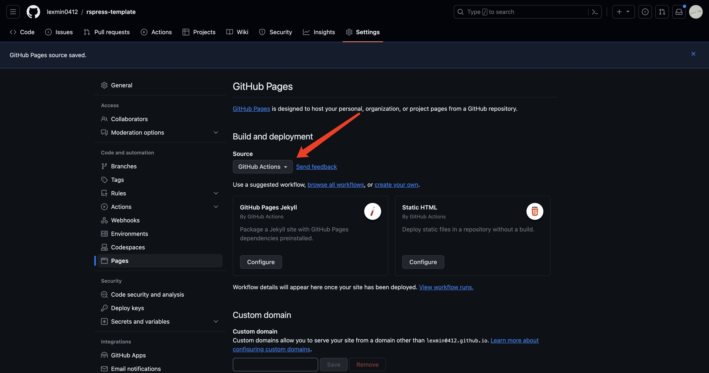
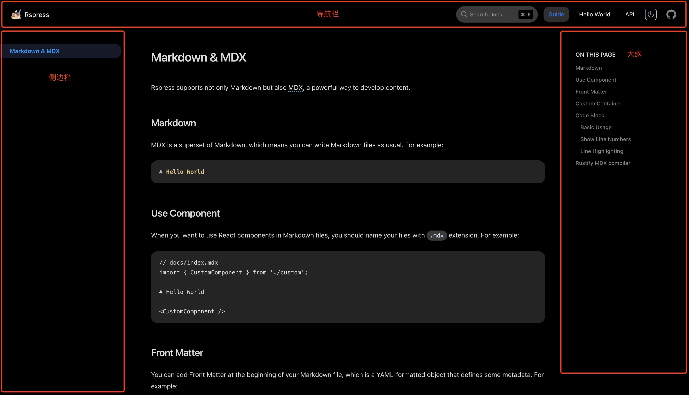
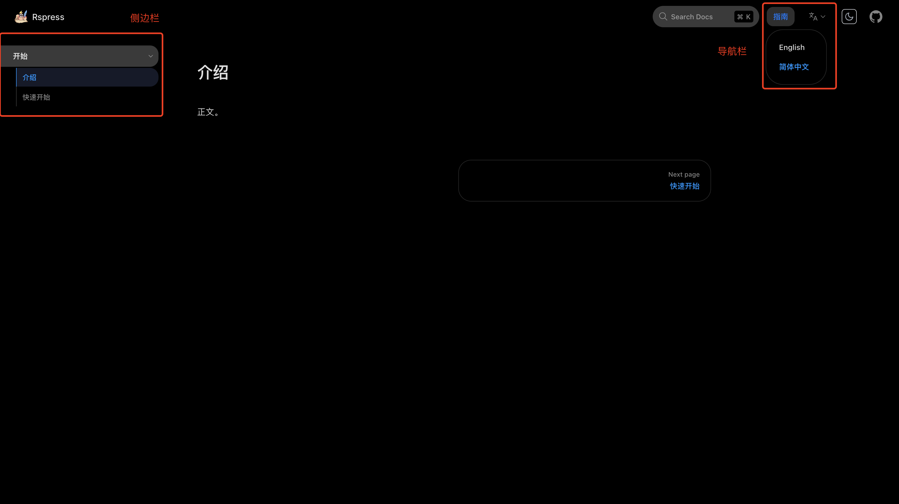

# Rspress Template

基于 Rspress 构建、开箱即用的文档站点模板，集成 Github Actions 自动化部署、国际化等功能。

## 模板搭建步骤

### 1. 初始化模板

通过 Rspress 脚手架命令创建项目：

```shell
npm create rspress@latest
```

按照提示输入项目名称及描述等信息，即可创建一个 Rspress 项目。

然后进入项目目录，安装依赖：

```shell
# 进入项目目录
cd rspress-template
# 安装依赖
pnpm install
```

### 2. 新建 README 文件

在根目录新建 README.md 文件，填写基础信息：

```markdown
# Rspress Template

基于 Rspress 构建的文档站点模板，集成了常用功能以达到开箱即用。
```

### 3. 本地开发及构建

初始化模板后，Rspress 脚手架已经在 scripts 中注入了三个命令，分别是：

- dev 启动本地开发服务器
- build 生产环境构建
- preview 本地预览 build 命令构建出的产物

在终端运行以上命令，与预期结果一致，进入下一步。

### 4. 第一次提交

```shell
# 初始化 Git 工作区
git init
# 添加远程源
git remote add origin git@github.com:lexmin0412/rspress-template.git
# 设置当前工作区的 git 账号，防止使用错误账号进行提交
gcm use github
# 暂存
git add .
# 提交
git commit -m 'feat: 初始化模板'
# 推送
git push -u origin main
```

### 5. 配置 Github Actions 实现自动化部署

前置条件：github 仓库必须为 public，如果是 private，请先切换后再进行下面的步骤。

#### 5.1 修改 GitHub Pages 部署方式

当前版本的 Github Pages 默认部署方式为根据分支部署，我们需要切换到 Github Actions。



#### 5.2 添加配置文件

在根目录新建 .github/workflows/deploy.yml 文件，填入如下内容：

```shell
name: Deploy Rspress site to Pages

on:
  push:
    branches: [main]

  workflow_dispatch:

permissions:
  contents: read
  pages: write
  id-token: write

concurrency:
  group: pages
  cancel-in-progress: false

jobs:
  # Build job
  build:
    runs-on: ubuntu-latest
    steps:
      - name: Checkout
        uses: actions/checkout@v3
        with:
          fetch-depth: 0 # Not needed if lastUpdated is not enabled
      - uses: pnpm/action-setup@v2 # pnpm is optional but recommended, you can also use npm / yarn
        with:
          version: 7
          cache: pnpm
      - name: Setup Node
        uses: actions/setup-node@v3
        with:
          node-version: 18
          cache: pnpm
      - name: Setup Pages
        uses: actions/configure-pages@v3
      - name: Install dependencies
        run: pnpm install
      - name: Build with Rspress
        run: |
          pnpm run build
      - name: Upload artifact
        uses: actions/upload-pages-artifact@v2
        with:
          path: doc_build

  # Deployment job
  deploy:
    environment:
      name: github-pages
      url: ${{ steps.deployment.outputs.page_url }}
    needs: build
    runs-on: ubuntu-latest
    name: Deploy
    steps:
      - name: Deploy to GitHub Pages
        id: deployment
        uses: actions/deploy-pages@v2
```

#### 5.3 修改 rspress 配置

由于我们的部署环境是 Github Pages，而它分配给每个 Repo 的只是一个域名下的二级路由，如仓库名为 rspress-template，则可访问的 pages 域名为 `https://lexmin0412.github.io/rspress-template`，所以我们需要调整 rspress 配置，以能够访问到部署目录下的静态资源文件(如 css/js 等)以及路由。

修改根目录下的 rspress.config.ts, 加入如下内容：

```ts
export default defineConfig({
	// history 路由前缀
	base: '/rspress-template/',
	builderConfig: {
		output: {
			// 给所有 static 目录下的静态文件引用添加前缀以便能够正确访问
			assetPrefix: '/rspress-template/'
		}
	},
})
```

推送代码，等待 Actions 执行完成后访问 https://lexmin0412.github.io/rspress-template 查看效果。

#### 5.4 修复图片

在上面的步骤中，我们已经成功地部署了静态站点，但会发现 logo 图片依然无法访问。

在 Rspress 构建后，docs/public 目录下的图片会被原封不动地移动到构建产物根目录下，所以我们修改 rspress.config.ts 文件：

```ts
export default defineConfig({
	icon: "https://lexmin0412.github.io/rspress-template/rspress-icon.png",
	logo: {
		light: "https://lexmin0412.github.io/rspress-template/rspress-light-logo.png",
		dark: "https://lexmin0412.github.io/rspress-template/rspress-dark-logo.png",
  },
	builderConfig: {
		output: {
			assetPrefix: 'https://lexmin0412.github.io/rspress-template/'
		}
	},
})
```

修改 docs/index.md，给图片加上路由前缀或改为完整的远程路径:

```markdown
---
pageType: home

hero:
  image:
    src: /rspress-template/rspress-icon.png
```

再次推送代码，actions 执行成功后，会发现所有的 css/js/图片都加上了 assetPrefix 对应的值，可以正常访问了。

### 6. 审视并调整目录结构

初始化的目录结构如下：

- guide 文档文件夹
	- meta.json
	- index.md
- public
	- rspress-dark-logo.png
	- rspress-icon.png
	- rspress-light-logo.png
- _meta.json 顶部导航栏
- hello.md
- index.md

通过下图来看一下页面的基本结构：



基于页面基本结构，我们来对这些已存在的文件做一个大体的说明，

#### 6.1 index.md

根目录的 index.md 作为整个文档站点的入口页，一般是对此站点的内容做一个大体的介绍，让用户一眼就能了解这个站点关联的产品，以及它们具体的用途。

#### 6.2 _meta.json

_meta.json 是 rspress (相对于 vitepress/vuepress 等)独有的配置文件，用于配置导航栏和侧边栏的内容，相对于在 rspress.config.ts 中配置 themeConfig 的方式，是官方更推荐的方式。

它可以分为两类：

- 导航栏级别，位于根目录
- 侧边栏级别，位于子目录

导航栏配置示例：

```json
[
  {
    "text": "Guide", // 菜单名
    "link": "/guide/",  // 点击菜单的跳转链接
    "activeMatch": "^/guide/"  // 匹配到这些条件时菜单高亮
  }
]
```

#### 6.2 guide

guide 意为指南，一般作为一个目录看待，里面包含产品的使用文档，如列出组件库中每一个组件的使用方法、示例及属性说明。

当然此目录不是必须存在的，它可以没有，也可以是其他名字，不过我们的目标是搭建一个通用的模板，就以此作为一个比较通用的示例。

guide/index.md 文件，与在根目录中放置一个 guide.md 本质上并无区别，但由于 guide 目录下还会有其他很多相关的内容，就以此作为整个目录的入口。

guide/_meta.json 即上文提到的 侧边栏 级别的 _meta.json 配置文件。

#### 6.3 调整目录结构

调整我们的目录结构如下：

```shell
docs # 文档根目录
|- guide # 指南
   |- start # 开始
      |- _meta.json # start 菜单下的侧边栏配置
      |- quick-start.md # 子文档
      |- introduction.md # 子文档
   |- usage # 用法
      |- index.md # 单一文章目录
   |- _meta.json # guide 菜单下的侧边栏配置
|- _meta.json # 导航栏配置
|- index.md # 首页
```

其中三个 _meta.json 内容如下：

`_meta.json`，其中包含对导航栏的菜单配置：

```json
[
  {
    "text": "guide",
    "link": "/guide/start/introduction",
    "activeMatch": "/guide/"
  }
]
```

`guide/_meta.json`，其中包含对 guide 目录下的菜单配置：
```json
[
  {
    "type": "dir",
    "name": "start",
    "label": "start"
  }
]
```

`guide/start/_meta.json`，其中包含对 guide/start 目录下的菜单配置：

```json
[
  {
    "type": "file",
    "name": "introduction",
    "label": "introduction"
  },
	{
    "type": "file",
    "name": "quick-start",
    "label": "quick-start"
  }
]
```

至此我们的目录结构调整告一段落。

### 7. 国际化

国际化在开源项目中属于比较常见的功能，所以我们也将它囊括进模板。

官方的国际化指引请 [点我查看](https://rspress.dev/zh/guide/default-theme/i18n.html)，在此我们针对此模板进行配置。

#### 7.1 定义 I18n 文本数据

在工作区的根目录新建 i18n.json 文件，填入如下内容：

```json
{
  "guide": {
    "zh": "指南",
    "en": "Guide"
  },
	"start": {
		"zh": "开始",
		"en": "Start"
	},
	"introduction": {
		"zh": "介绍",
		"en": "Introduction"
	},
	"quick-start": {
		"zh": "快速开始",
		"en": "Quick Start"
	}
}
```

基本的定义规范是：

- key 使用英文小写，与文件名保持一致
- 中文不带空格
- 英文使用大写字母开头，多个单词使用空格分隔

可以看到我们目前定义了顶部导航和侧边栏菜单的中英文文本。

为了能够在 MDX 自定义组件中提供类型提示，我们需要在 tsconfig.json 中写入如下配置：

```json
{
  "compilerOptions": {
    "paths": {
      "i18n": ["./i18n.json"]
    }
  }
}
```

#### 7.2 配置默认语言

在 rspress.config.ts 新增如下内容：

```ts
import { defineConfig } from 'rspress/config';

export default defineConfig({
  lang: 'zh',
});
```

我们设置中文作为默认语言，对于默认语言下的路由，Rspress 会去除掉语言前缀，如 `rspress-template/zh/guide/start/quick-start` 会变为 `rspress-template/guide/start/quick-start`。

#### 7.3 配置 locales 数据

Rspress 允许在 rspress.config.ts 中的 locales 和 themeConfig.locales 中配置 locales 数据，其中后者的优先级会更高，我们直接使用后者：

```ts
export default defineConfig({
	themeConfig: {
		locales: [
			{
				lang: 'en',
				label: 'English',
				// 可以定义更多系统属性
			},
			{
				lang: 'zh',
				label: '简体中文',
				// 可以定义更多系统属性
			},
		],
	}
})
```

此配置决定了在顶部导航栏的语言切换下拉菜单中的展示内容。

在对应的语言下，还可以定义主题中的其他支持多语言的属性，如大纲、上一页/下一页、最后更新时间等，[点此查看](https://rspress.dev/zh/api/config/config-theme.html#locales) 类型定义。


#### 7.4 调整目录结构

为了支持多语言，我们需要将不同语言下的文件存放在不同的目录中。

1. 在 docs 目录下分别新建 zh、en 文件夹
2. 将除 public 和 zh 目录之外的所有文件全部移动到 zh 目录
3. 将 zh 目录下的所有文件复制一份到 en 目录

新的目录结构如下：

```shell
docs
|- zh # 中文
   |- guide
      |- start
         |- _meta.json
         |- quick-start.md
         |- introduction.md
      |- usage
         |- index.md
      |- _meta.json
   |- _meta.json
   |- index.md
|- public # 静态资源，如文档中引用的图片、视频等
|- en # 英文
   |- guide
      |- start
         |- _meta.json
         |- quick-start.md
         |- introduction.md
      |- usage
         |- index.md
      |- _meta.json
   |- _meta.json
   |- index.md
```

#### 7.5 使用 I18n 文本数据

在 [7.1](#71-定义-i18n-文本数据) 中我们定义了文本数据，现在我们来使用。

导航栏配置，以 zh/_meta.json 为例：

```json
[
  {
    "text": "guide",
    "link": "/guide/start/introduction",
    "activeMatch": "/guide/"
  }
]
```

`text` 属性即为 i18n key。

侧边栏配置，以 zh/guide/_meta.json 为例：

```json
[
  {
    "type": "dir",
    "name": "start",
    "label": "start"
  }
]
```

`label` 属性即为 i18n key。

#### 7.6 查看效果

重新启动项目，会发现顶部导航栏的语言切换中显示了 English 和 中文 两个选项，顶部和左侧的菜单名称均显示了中文，这与我们的配置预期一致。



